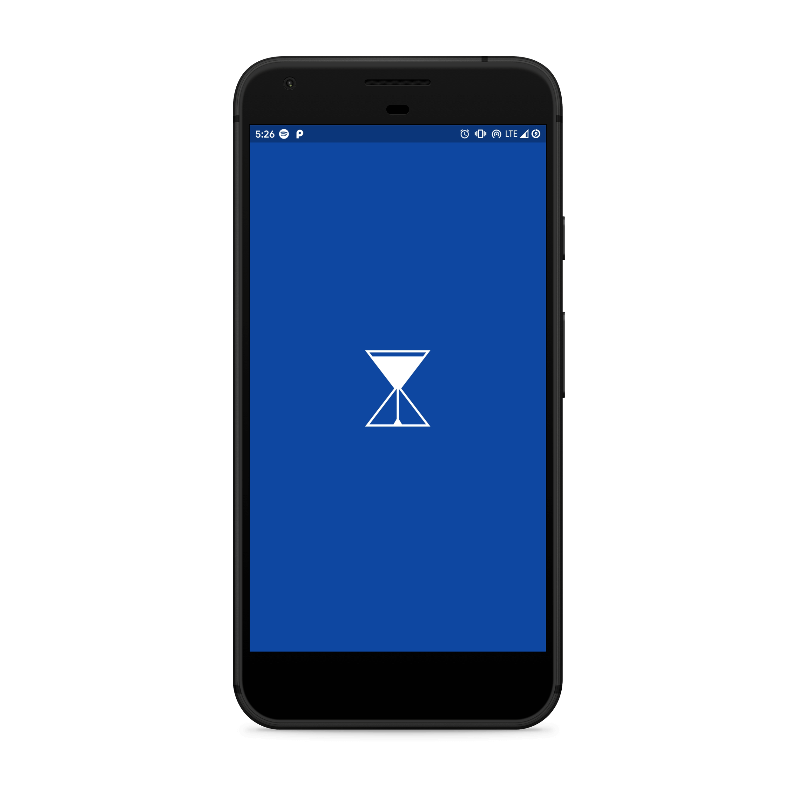
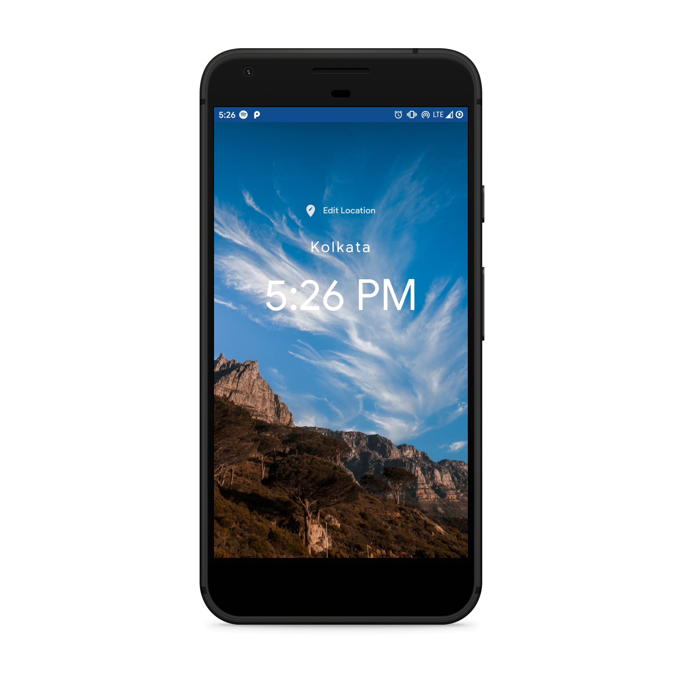
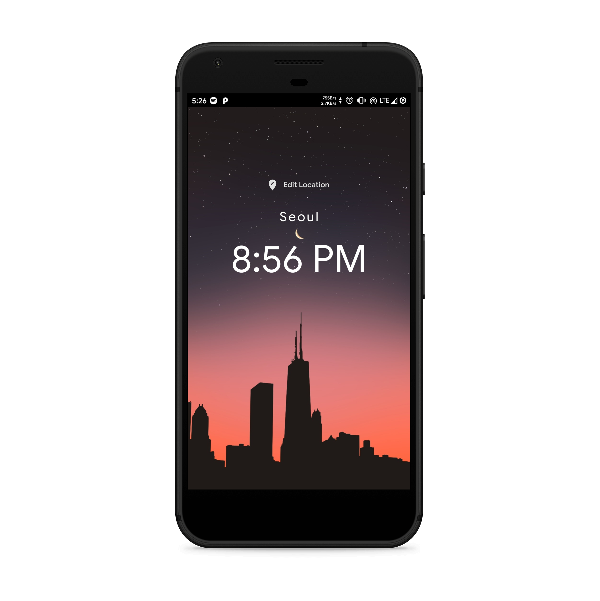

# World Time App

Flutter Application to view time in different parts of world. This was my first app built while learning flutter

# App Screenshots

Loading Screen at start                
:-------------------------:
  |

One location               |  Another location
:-------------------------:|:-------------------------:
  |  

# Donate
> If you found this project helpful or you learned something from the source code and want to thank me, consider buying me a cup of :coffee:

# Download
You can [download](https://github.com/AkashRajpurohit/World_Time_App/releases/download/v1.0/app-arm64-v8a-release.apk) the application for android and try it yourself.

# Bugs or Requests

If you encounter any problems feel free to open an [issue](https://github.com/AkashRajpurohit/World_Time_App/issues/new). Pull request are also welcome.

## Visit My Portfolio
[Akash Rajpurohit](https://akashrajpurohit.cf)
# Assignment-world-time
